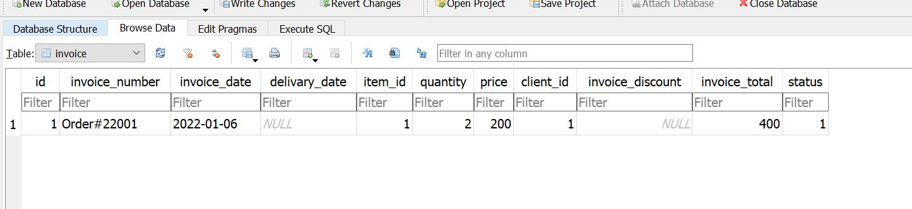

## How to add data in a table:

```sql
INSERT INTO client(name, mobile,email, address) VALUES("Tareq", "01614048774", "tirahman105@gmail.com", "Dhaka");
```

* name, mobile, email, address these are fields.
* Tareq, 01614048774, tirahman105@gmail.com, Dhaka these are value. All these values are text type thats why we are writing this in " ".

#

## How to see all data from a table? 

```sql 
SELECT * FROM client
```


#

## How to delete data from table?

```sql
DELETE FROM client WHERE id=2;
```


If we want to delete all data from table, 

```sql
DELETE FROM client
```
## What is sqlite_sequence? 

sqlite_sequence is a table which is created autometically when a database is created. 

It records all id value. 

If we delete any data from any table it will erase data from that table but the sqlite_sequence table will keep the id number sequence. 


#

## How to reset the sqlite_sequence table?

```sql
UPDATE sqlite_sequence SET seq=0 WHERE name="client";

```


#
## How to show data of one table in another table?

By joining we can show data of one table to another table. 

Types of joining

* Inner join
* Outer join

#





I will update more about joining.

